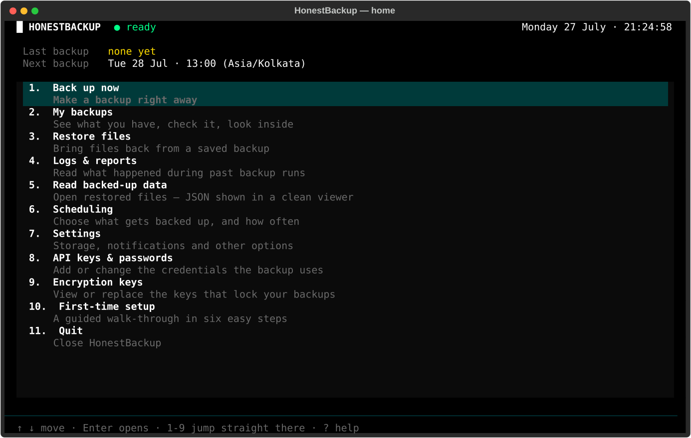
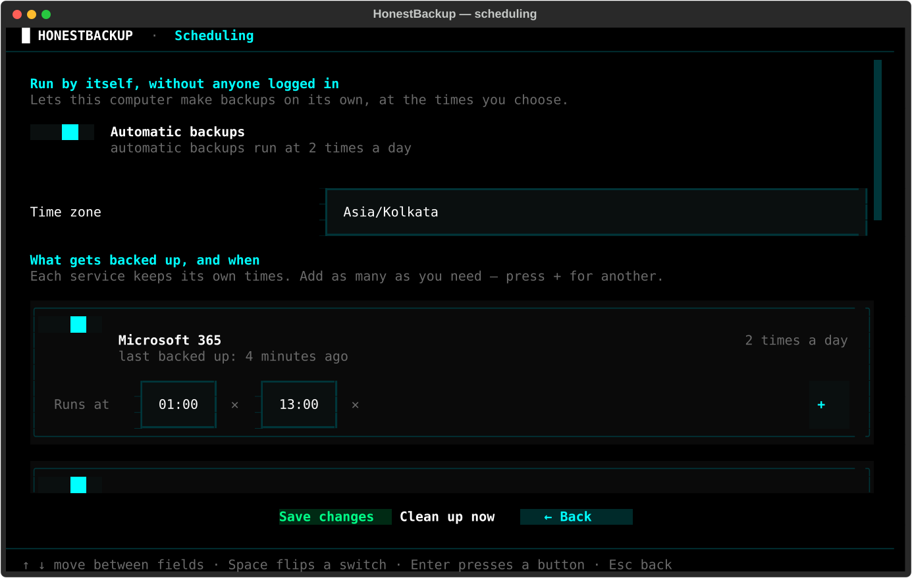
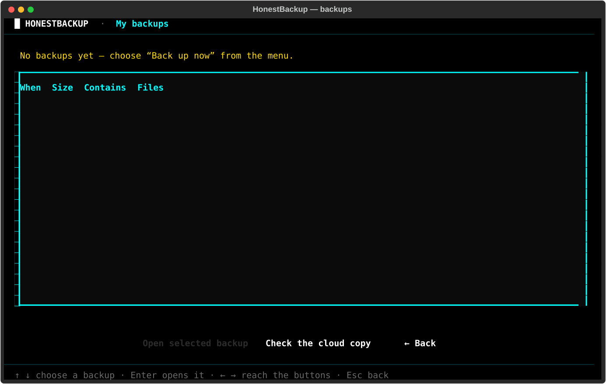
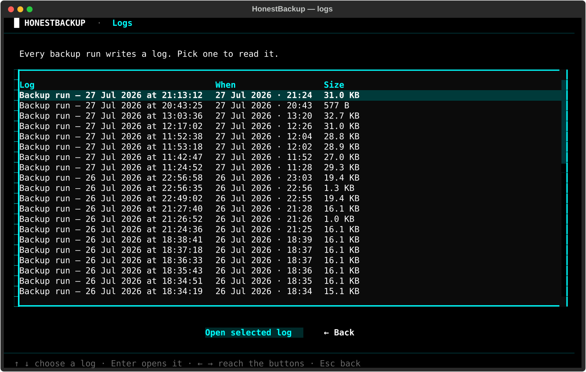

# HonestBackup

Backs up Microsoft 365, Cloudflare and Notion to encrypted archives you own.

Most SaaS backup tools are a subscription and a promise. This is a script you
run on your own machine, writing `age`-encrypted archives to your own storage.
Nothing can read them without your key - not the cloud provider, not us.

It exists because Microsoft keeps the Unified Audit Log for 180 days and
sign-in logs for 30, and compliance frameworks tend to ask for years.



---

## What it backs up

| | |
|---|---|
| **Microsoft 365** | Unified Audit Log, Entra sign-in and directory logs, Defender alerts and incidents, Conditional Access, users, groups, roles, deleted objects, mail, calendars, contacts, SharePoint and OneDrive files |
| **Cloudflare** | Zones, DNS, WAF and firewall rules, Zero Trust config, account audit log |
| **Notion** | Full workspace export, database schemas and rows |

What is and isn't collected - and why - is written up in
[docs/coverage.md](docs/coverage.md).

## How it works

```
collect → manifest → tar → zstd → age encrypt → SHA-256 → store
```

Archives go to three places, each with its own retention: the local machine,
Backblaze B2, and an external drive. Every archive is hash-verified on write
and can be re-verified at any time.

Backups are incremental. The first run downloads everything; later runs fetch
only what changed, using API delta tokens where the provider offers them and
file size comparison where it doesn't. A run that finds nothing new fetches
close to nothing - in practice around 1 MB against 80 MB for a first run.

Each archive is still a *complete* snapshot, not a chain of deltas. What
incremental saves is the download and the disk, not the archive: today's
workspace is hardlinked from yesterday's, so unchanged files cost no space,
and any archive can be restored on its own without needing the ones before
it. There is no chain to break.

---

## Getting started

**You need:** Python 3.11+, `age`, `zstd`, `rclone`, `keepassxc-cli`.

```bash
git clone https://github.com/5h1Vm/honest-backup.git
cd honest-backup
./first-run.sh
```

`first-run.sh` takes a bare server to a working installation: it installs
what is missing, generates this installation's own encryption key, creates
its credential database, points it at its bucket, writes the configuration -
and then proves each piece answers before saying it is done.

```bash
./first-run.sh --answers-file > answers.txt   # fill this in beforehand
./first-run.sh --answers answers.txt          # then run unattended
./first-run.sh --check                        # test an install, change nothing
```

After that, everything is done from the terminal interface:

```bash
python3 -m orchestrator.run --tui
```

The interface and `first-run.sh` are the same installation and write the same
files, so whatever one does the other sees. The difference is only that the
interface edits an installation that exists, while `first-run.sh` is what
creates one - on a fresh server there is no credential database for the
interface to open, and it has no way to make one.

Nothing needs editing by hand, though `config/backup.conf.example` documents
every setting if you'd rather.

**Every installation is self-contained.** Its own key, credentials, bucket and
schedule. Nothing is shared between installations, which is what makes it safe
to hand one to somebody and walk away.

### Credentials

API keys live in an encrypted credential database, never in config files or
environment variables. The setup wizard creates it. You'll need:

- **Microsoft 365** - an Entra app registration with application permissions
  (`AuditLogsQuery.Read.All`, `SecurityEvents.Read.All`, `Sites.Read.All`,
  `Mail.Read`, and friends), admin-consented. SharePoint file access
  additionally needs a certificate - Graph won't accept a client secret for it.
- **Cloudflare** - an API token with read access to the zones and account.
- **Notion** - an internal integration token.
- **Backblaze B2** - an application key scoped to one bucket.

---

## Using it

```bash
python3 -m orchestrator.run --tui           # the interface
python3 -m orchestrator.run --force         # back up now
python3 -m orchestrator.run --check-cloud   # is the cloud copy complete?
```

Everything is reachable from the interface, which works entirely by keyboard 
arrow keys, Enter, Escape.

### Scheduling

Each service keeps its own run times, set in whichever time zone you think in.



Those times are merged into a crontab: every distinct moment becomes one entry
naming the services due then, so services sharing a time share a single run.
The conversion to the machine's own zone happens before cron sees it, because
Ubuntu's cron ignores `CRON_TZ` and would otherwise run your backup hours away
from where you wanted it.

### Restoring



Pick a backup, pick files, restore. Or by hand:

```bash
age -d -i key.txt backup.tar.zst.age | zstd -d | tar -x
```

The archive format is deliberately boring. If this project vanishes, three
standard tools still open your data.

### Reading what's inside



Decrypted archives can be browsed in place - JSON is pretty-printed, and ZIPs
(including the nested ones Notion exports) open without extracting.

---

### Reports

Every run writes a report - what was collected, what wasn't, and why - and
sends it by email and Telegram. A copy is also kept in the repository under
`reports/`, which syncs to Backblaze and the external drive like everything
else.

Reports are deliberately **not encrypted**. A report is a summary of what ran,
never the tenant's data, so reading one needs no key:

```bash
python3 office/view.py --reports              # what reports are here
python3 office/view.py --report <backup-id>   # read one
```

That is the whole point of keeping them: somebody can confirm last night's
backup ran, and see what a licence stopped it collecting, without being
trusted with the key that opens the archives.

The headline only escalates for something that needs a person. A licence the
tenant does not own, and a provider that was down for ten minutes, are both
listed under the run - not put in front of it. A label that fires on the
ordinary run is one people learn to ignore, and then it cannot warn them about
the run that matters.

## Knowing the backups are actually there

A file listing only tells you what *is* in your bucket. It can't tell you what
*should* be - so a failed upload, a deleted archive, or a credential pointing
at the wrong bucket all look perfectly healthy.

So every sync appends to a ledger: backup id, size, SHA-256, where it went.
The ledger is stored on the server, in the bucket, and on the external drive.

```bash
python3 -m orchestrator.run --check-cloud
```

```
  Cloud:    backblaze:your-bucket
  Ledger:   412 backups, 23,104,882,110 bytes

  the cloud holds all 412 archives the ledger expects
  OK
```

Point it at an empty bucket and it says `412 expected - 412 missing` instead of
quietly agreeing with itself.

## The office copy

[`office/`](office/README.md) is a standalone folder for a second machine that
keeps a copy on an external drive. It pulls from B2, verifies every archive
against its hash, and never deletes anything. `reseed.py` goes the other way 
refilling a lost or migrated bucket from the drive.

**The encryption key never travels on the drive.** Reading a backup there asks
for it each time, hidden, and holds it only in that terminal's memory. So a
lost drive is not a copy of the data.

It is not, however, a folder of no consequence. Whether it carries the storage
credentials is a choice made at install time:

```bash
./office/install-to-drive.sh /media/…/Drive --no-credentials         # safest
./office/install-to-drive.sh /media/…/Drive --plaintext-credentials  # portable
```

Without them the drive only works on a machine that already has the remote
configured. With them it works anywhere, and whoever finds it can reach the
bucket - so scope that key to the one bucket, read-only. A key that can delete
every bucket in the account turns a mislaid drive into a much larger problem
than a mislaid drive.

Reports are the exception to all of this: they are stored unencrypted, because
a report says what ran and what did not, never the tenant's data. Anyone can
read them from the drive with no key at all, which is the point - checking that
last night's backup ran should not require being trusted to decrypt it.

---

## Running it in a container

```bash
docker compose build
docker compose run --rm backup
```

The image runs one backup and exits, because that is what a scheduled job
wants - Container Apps Jobs, Kubernetes CronJobs and `docker run` on a timer
all expect the process to finish. The container is not the scheduler; use the
platform's, and drop the crontab this project writes for a VM.

Notion's export runs headless Chromium inside the container, which works
without ceremony - the collector already launches with `--no-sandbox` and
`--disable-dev-shm-usage`. Give it **2 GB of memory**: below that Chromium is
killed partway through the export, and the error does not mention memory.

### The one constraint that matters

`workspace/` is hardlinked from the previous run. **Azure Files over SMB does
not support hardlinks**, and neither do most object-storage gateways. Put the
workspace on something POSIX - a managed disk, Azure Files over NFS, ext4,
XFS.

Getting this wrong used to be silent: the run would succeed, the log would
still say `INCREMENTAL`, and every file would be fetched in full for ever. It
now refuses to start and says why.

### What has to outlive the container

| | | |
|---|---|---|
| `workspace/` | ~400 MB | the previous run's copy; without it nothing is incremental |
| `backupvault/` | grows | the archives, though B2 is their real home |
| `state/` | tiny | delta tokens and audit checkpoints |
| `honestbackup-profile/` | ~400 MB | Notion's **logged-in session** |
| `config/keys/`, `secrets.kdbx` | tiny | the key and the credentials |

Secrets are mounted, never copied into a layer - an image gets pushed to a
registry and pulled by anyone with read access, and a key baked into one is a
key you can no longer account for. In Azure, prefer Key Vault with a managed
identity over passing `KEEPASS_PASSWORD` as an environment variable.

Notion's session is the fragile part. Everything else is API calls that
containerise cleanly; Notion is a logged-in browser, so seed the profile
volume from a machine where you have signed in, and expect to redo that
whenever the session eventually expires.

## Notes

**Retention is per destination.** Local is short, cloud is long, the drive is
forever. Nothing should ever be down to one copy.

Every archive is a full snapshot, so the cloud grows by its full size on every
run whatever the incremental saved on the download. At two runs a day that is
roughly 55 GB and about $0.33 a month per year of history - cheap enough that
expiring the cloud copy rarely pays for the risk. The reason to expire it is
usually not the bill but **Verify**, which re-hashes every archive it holds and
gets slow long before the cost matters.

**The encryption key is the whole thing.** Lose it and the archives are noise.
Rotating it is supported and keeps the old key for old archives, but keep a
copy somewhere offline.

**Licences limit what Microsoft will hand over.** Risky-user scoring needs
Entra ID P2, mail threat telemetry needs Defender for Office 365 P2. The tool
reports these as known limits rather than failures, so a warning means
something is genuinely wrong.

## Layout

```
collectors/     one package per service
orchestrator/   the run itself: scheduling, archiving, retention
storage/        repository, sync, ledger
lib/            logging, reporting, credentials
tui/            terminal interface
office/         the external-drive copy, deployed separately
```

---

## Internal use

This is an internal tool, not a public release. It is not licensed for
redistribution and comes with no warranty or support.
